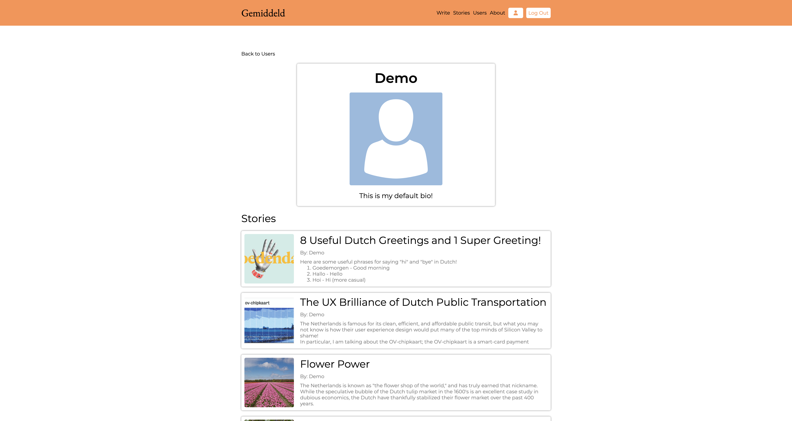

# Gemiddeld 
Gemiddeld is a Dutch- and walkable-community-themed clone of Medium built using technologies such as React, Node, Postgres, and Express.

### Try it out!
[Live heroku link!](https://gemiddeld.herokuapp.com/)

### Important Links
* [Feature List](https://github.com/connorwfitch/react-solo-project/wiki/Feature-List)
* [Database Schema](https://github.com/connorwfitch/react-solo-project/wiki/Database-Schema)
* [Frontend Routes](https://github.com/connorwfitch/react-solo-project/wiki/Frontend-Routes)
* [Backend Routes](https://github.com/connorwfitch/react-solo-project/wiki/Backend-Routes)

### Technologies used

### Splash Page

### Login Page

### Story Page

### User Page

### Installation Instructions
1. Clone the repository using `git clone git@github.com:connorwfitch/react-solo-project.git`
2. Install frontend packages using `cd frontend` and `npm install`
3. Install backend packages using `cd ../backend` and `npm install`
4. Add `.env` file in backend directory using `touch .env` and setting it up as outlined in `.env.example`
5. Create a Postgres user in accordance with your `.env` file
6. Create, migrate, and seed your database by running the following commands
  * `npx dotenv sequelize db:create`
  * `npx dotenv sequelize db:migrate`
  * `npx dotenv sequelize db:seed:all`
7. Open up two terminals one for `/frontend` and the other for `/backend`, and run `npm start` in both
8. If not automatically redirected, navigate in your browser to `http://localhost:3000/`

### Future To-Dos
* Add Phase 2 features (Likes, Topics)
* Add Bonus Features (Following, User Profile Edit/Delete, Nested Comments/Replies)
